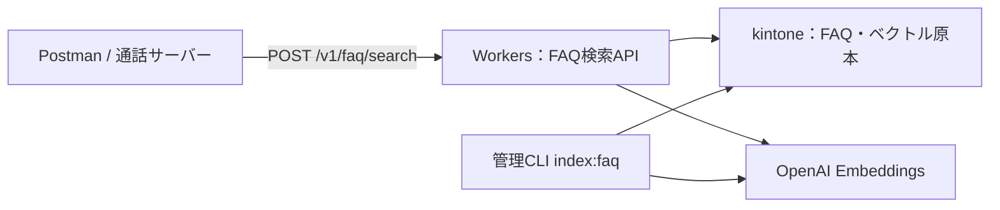

# kintone-semantic-search：kintone FAQ のセマンティック検索API（Cloudflare Workers）

kintone の FAQ（アプリ 146：カテゴリ・質問・回答）を Embedding で意味検索し、**回答生成の根拠**（FAQ本文・出典ID・検索状態）を JSON で返すサーバー間 API です。開発依頼用の仕様書（リポジトリ外で管理）に基づきます。本文中の「仕様 N章」はその仕様書の章番号です。

- 検索API内で回答文は生成しません（生成は将来接続する通話側 Realtime モデルの役割。仕様 1章）。
- 外部DB・Vectorize・KV は使いません。ベクトルの原本は kintone の文字列（複数行）フィールドです。
- 今回のスコープは **Postman から REST API で検索できるところまで** です。Vonage／Realtime 連携（仕様 10章のツールアダプター）は含めていません（→「残課題」）。

## 本番環境

| 項目 | 値 |
|---|---|
| ベースURL | `https://kintone-semantic-search.katsumi.workers.dev` |
| 検索 | `POST /v1/faq/search`（`Authorization: Bearer <FAQ_SEARCH_API_KEY>` 必須） |
| 生存確認 | `GET /healthz`（認証不要） |

検索APIキーは通話接続サーバーにだけ渡すサーバー間用のキーで、このリポジトリには含めていません。キーがない、または不正なリクエストは `401 UNAUTHORIZED` になります。

```bash
curl -s -X POST https://kintone-semantic-search.katsumi.workers.dev/v1/faq/search \
  -H "Authorization: Bearer $FAQ_SEARCH_API_KEY" -H 'Content-Type: application/json' \
  -d '{"query":"Teamsと連携するのにMicrosoft 365の有料プランは必要？","limit":3}'
```



## ディレクトリ構成

| パス | 内容 |
|---|---|
| `src/shared/` | Worker と CLI の共通ライブラリ：正規化・ハッシュ（`text.ts`）、ベクトル検証（`vector.ts`）、検索コア（`search.ts`）、スナップショット構築（`snapshot.ts`）、kintone / Embedding クライアント |
| `src/worker/` | Workers 実装：ルーティング・認証・入力検証・期限管理・エラー分類（`app.ts`）、isolate 内キャッシュ（`cache.ts`）、設定（`config.ts`） |
| `cli/` | 管理CLI：差分索引 `index-faq.ts`、疎通確認 `check-deps.ts` |
| `scripts/` | 精度評価 `eval-search.ts`、性能測定 `bench.ts`、モック上流サーバー `mock-upstream.ts`、合成サンプルFAQ |
| `test/` | 単体・統合テスト（vitest、モック上流を使用。外部APIを呼ばない） |
| `openapi.yaml` | OpenAPI 3.1 定義 |
| `postman/` | Postman コレクション（テストスクリプト付き） |
| `eval/` | 評価セットの例（本番用は `eval/*.local.json` に作成。git 管理外） |
| `docs/report-template.md` | 測定レポートの雛形 |

## 前提

- Node.js 22.9 以上（`--env-file-if-exists` を使用）
- Cloudflare Workers Paid プラン（Rate Limiting binding を使用）
- `npm install`

## 1. kintone の準備（アプリ 146）

アプリ 146 には `category`（ドロップダウン）/ `question`（文字列1行）/ `answer`（文字列複数行）があります。以下の4フィールドを**追加**してください（フィールドコードは変更可。変更した場合は `FIELD_*` で指定）。

| 表示名 | フィールドコード | 型 |
|---|---|---|
| ベクトル | `embedding` | 文字列（複数行） |
| ベクトル仕様ID | `embedding_spec` | 文字列（1行） |
| ベクトル化元ハッシュ | `embedding_hash` | 文字列（1行） |
| ベクトル生成日時 | `embedded_at` | 日時 |

- フィールドのアクセス権で、ベクトル関連4項目を一般ユーザーの**編集不可**にしてください（管理用項目）。フォームのレイアウト上は非表示のグループに入れるのがおすすめです。
- API トークンを2つ発行します。
  - **閲覧専用**（レコード閲覧）→ Workers の `KINTONE_READ_API_TOKEN`
  - **閲覧＋編集**（レコード閲覧・編集）→ 管理CLIの `KINTONE_WRITE_API_TOKEN`（Workers には置かない）
- kintone に IP 制限がある場合、Workers からの接続可否を確認してください（Workers は固定送信元IPを持ちません）。

## 2. ローカルで試す（APIキー不要のモック）

kintone と OpenAI の代わりにモック上流サーバーを使い、合成サンプルFAQ 12件で動作を確認できます。擬似 Embedding は文字 n-gram のハッシュなので、**スコアの値や精度には意味がありません**（API契約・処理経路の確認用）。

```bash
# ターミナル1：モック上流（索引済みのサンプルFAQで起動）
npm run mock:upstream

# ターミナル2：Worker（.dev.vars を作らずに引数で上書き）
npx wrangler dev --port 8787 \
  --var KINTONE_BASE_URL:http://127.0.0.1:8788 --var KINTONE_READ_API_TOKEN:mock-token \
  --var EMBEDDING_BASE_URL:http://127.0.0.1:8788/v1 --var EMBEDDING_API_KEY:mock-key \
  --var EMBEDDING_MODEL:mock-hash-embedding --var EMBEDDING_DIMENSIONS:256 \
  --var EMBEDDING_SPEC_ID:openai/mock-hash-embedding/256/faq-v1 \
  --var MIN_SIMILARITY:0.2 --var FAQ_SEARCH_API_KEY:local-dev-key
```

Postman で `postman/kintone-semantic-search.postman_collection.json` をインポートし（`baseUrl=http://127.0.0.1:8787`、`apiKey=local-dev-key` が既定値）、コレクションを実行します。curl なら:

```bash
curl -s -X POST http://127.0.0.1:8787/v1/faq/search \
  -H 'Authorization: Bearer local-dev-key' -H 'Content-Type: application/json' \
  -d '{"query":"パスワードを忘れたので再設定したい","limit":3}'
```

## 3. 実データで試す（kintone アプリ 146 + OpenAI）

```bash
cp env.example .env                 # 管理CLI・スクリプト用。値を設定
cp .dev.vars.example .dev.vars      # wrangler dev 用の Secrets。値を設定

npm run index:faq -- --dry-run      # 生成対象と検証エラーを確認（APIを呼ばない・書き込まない）
npm run index:faq                   # 未生成・変更分だけベクトルを生成して kintone に保存
npm run check:deps                  # kintone / Embedding の疎通と有効ベクトル件数を確認

npm run dev                         # wrangler dev（http://127.0.0.1:8787）→ Postman で確認
```

`KINTONE_BASE_URL` は `wrangler.toml` には書かず、ローカルでは `.dev.vars`、本番では Secret で設定します。

## 4. デプロイ

本番デプロイは担当者が行ってください（このリポジトリの作業では実施していません）。

```bash
npx wrangler secret put FAQ_SEARCH_API_KEY       # 通話サーバーにだけ渡す検索用キー（十分に長いランダム値）
npx wrangler secret put KINTONE_READ_API_TOKEN   # 閲覧専用トークン
npx wrangler secret put EMBEDDING_API_KEY        # OpenAI API キー
npx wrangler secret put KINTONE_BASE_URL         # 例 https://xxx.cybozu.com（公開リポジトリに接続先を載せないため Secret にする）
# wrangler.toml の [vars]（アプリID、しきい値など）を確認してから
npm run deploy
npm run check:deps -- --query "パスワードを忘れた"   # SEARCH_API_URL を .env に設定しておく
```

## 管理CLI（`npm run index:faq`）

| コマンド | 動作 |
|---|---|
| `npm run index:faq -- --dry-run` | 変更対象と検証エラーだけを表示。Embedding 呼び出し・書き込みなし |
| `npm run index:faq` | 未生成・本文ハッシュ変更・仕様ID変更・ベクトル破損のレコードだけ生成 |
| `npm run index:faq -- --id 42` | 指定レコードだけ処理（`--id 1 --id 2` / `--id 1,2` も可） |
| `npm run index:faq -- --force` | 全対象を再生成。**全件分の Embedding API 料金が発生します** |

- 更新は元の `$revision` を指定し、ベクトル関連4項目だけを書き換えます。競合時は上書きせず再取得・再評価し、最大2回再試行します。それでも競合する場合は失敗として報告します。
- 並列度は既定2。429・5xx は上限付き指数バックオフ（`Retry-After` を尊重）。
- 終了時に更新・スキップ・競合・失敗の件数とレコードIDを表示し、失敗・競合があれば終了コード1を返します。FAQ本文・キーはログに出しません。
- 入力が `EMBEDDING_MAX_INPUT_CHARS`（既定6,000文字）を超えるレコードはエラーとして報告し、切り詰めて保存しません。原本を調整してください。

### 運用手順

1. kintone で FAQ を編集する
2. `npm run index:faq`（差分実行）→ 失敗0件を確認
3. キャッシュTTL（60秒）経過後に検索して確認（`meta.snapshot_at` と `meta.degraded` を確認）

CLI 実行前の編集済みレコードは、ハッシュ不一致として検索対象から外れます（`meta.degraded=true`）。削除は次の全件取得時に反映されます。

## 検索API

仕様 7章どおりです。詳細は `openapi.yaml` を参照してください。

- `POST /v1/faq/search`（`Authorization: Bearer <FAQ_SEARCH_API_KEY>`）
- `GET /healthz`（生存確認のみ。設定・FAQ・依存先を確認しない）

| status | 意味 |
|---|---|
| `matched` | 採用しきい値以上の候補あり |
| `ambiguous` | 1位と2位の差が `AMBIGUITY_MARGIN` 未満。比較用に上位2件以上を返す |
| `no_match` | 候補なし。`meta.reason` = `below_threshold` / `empty_category` |

`degraded=true` の `no_match` は「FAQが存在しない」と断言しない扱いにしてください。タイムアウト・上流障害は `no_match` ではなくエラー（504/502/503）になります。

### 処理の要点

- 認証 → レート制限 → Content-Type → ボディ上限 → 入力検証 の順。不正キーは外部APIを呼ぶ前に 401。
- 検索文 Embedding と FAQ 取得を並列に開始。全体期限 `SEARCH_TIMEOUT_MS`（`wrangler.toml` で 4,000ms）を共有し、各上流は `min(UPSTREAM_TIMEOUT_MS, 残り時間)` で打ち切り。片方が失敗したらもう片方も中止。検索パスでリトライはしません。
- キャッシュは isolate 内メモリ。TTL 60秒、期限切れデータでは回答しない、同時取得は1つにまとめる、完成後に一括差し替え。isolate ごとに独立してミスするため、キャッシュなしでも動作します。
- kintone 取得は `$id` 昇順の継続取得（500件/リクエスト）で全件。`category` はメモリ上で比較し、kintone クエリに利用者入力を埋め込みません。
- 構造化ログ（`console.log` の JSON 1行）：request_id、trace_id、HTTP状態、検索status、各処理時間、キャッシュ状態、取得件数・有効件数・理由別の不正件数、上流エラー分類。検索文・FAQ本文・キーは出しません。

## しきい値の決定（本番公開前に必須）

`MIN_SIMILARITY` / `AMBIGUITY_MARGIN` は既定値を持たず、未設定だと 500 になります。

**現在の値：0.42 / 0.02（2026-09-29 決定）**。アプリ146の79件と評価セット46問（言い換え26・曖昧10・対象外10）で評価しました。方針は取りこぼし重視です。

| 指標（46問全体） | 0.42 / 0.02（採用） | 0.47 / 0.05（参考） |
|---|---|---|
| Top-3 正解包含率 | 91.7% | 83.3% |
| 対象内の no_match 率 | 5.6% | 13.9% |
| 対象外の誤 matched 率 | 40.0% | 10.0% |
| 通常質問の過剰 ambiguous 率 | 11.5% | 23.1% |

類似度だけでは「FAQに似ているが記載のない質問」（例：請求書の郵送 0.560）と、正解がある質問（例：ファイアウォール 0.383）のスコアが重なり、1つのしきい値では両立できませんでした。そのため、しきい値は低めにして候補を渡し、「FAQに書いていない」の判断は FAQ 本文を読む Realtime 側（指示テンプレートの「FAQにない情報を付け足さない」）に委ねます。仕様 14.2 の「対象外の誤matched率 10%以下」は、Realtime 連携後に**最終回答の誤り**として測り直す必要があります。小規模な評価集合の結果であり、一般的な精度保証ではありません。

再評価の手順：

1. 実FAQから最低40問（言い換え20・曖昧10・対象外10）を作り、`eval/eval-set.local.json` に正解IDと期待状態を人が定義する（形式は `eval/eval-set.example.json`）。`split` で調整用 `tune` と評価用 `eval` に分ける。
2. `npm run eval:search -- --set eval/eval-set.local.json --sweep`  
   kintone の実ベクトルと本番と同じ検索コードで、`tune` から候補値を選び、`eval` で Top-3 包含率（目標90%以上）・対象外の誤matched率（目標10%以下）・曖昧判定の過不足を報告します。記録は `reports/` に JSON で残ります。
3. 決めた値を `wrangler.toml` に設定してデプロイし、`npm run eval:search -- --set ... --api` で API 経由でも確認する。
4. 設定値の比較は `npm run eval:search -- --set eval/eval-set.local.json --min 0.42 --margin 0.02 --split all` のように行う。

## 性能測定

```bash
npm run bench -- --concurrency 1,5,10 --requests 100 --queries eval/eval-set.local.json
```

- **実際の通話サーバー配置先から**実行してください。日本のPCからの測定だけで評価しないでください。
- ヒット／ミスは応答の `meta.cache` で分けて集計します。ミスは新規デプロイ直後や TTL 満了後に発生するため、ミス側が100件に届かない場合は追加測定してください。
- レート制限（60回/分）が効くため、測定時は `wrangler.toml` の `[[ratelimits]]` の `limit` を一時的に上げるか、条件ごとに1分以上空けてください。
- CPU時間は Cloudflare ダッシュボード（Workers Observability）または `npx wrangler tail` で確認します。
- 結果は `docs/report-template.md` に沿ってまとめてください。

## 料金の目安

- Embedding：検索1回ごとに検索文1件分（数十トークン程度）。索引はFAQ1件あたり数百トークン程度 × 対象件数。`--force` と `eval:search`・`bench` の実接続時も課金されます。単価は OpenAI の公式料金ページで確認してください。
- Workers：リクエスト数と CPU 時間。Workers 内の回答生成費用はゼロ（Realtime 側の料金は別途）。
- モック（`npm run mock:upstream`）とテスト（`npm test`）は外部APIを呼ばないため無料です。

## テスト

```bash
npm test          # vitest（75件、外部API不使用）
npm run typecheck
```

主な検証内容：同一・直交・逆向き・ゼロ・NaN・次元不一致のベクトル、カテゴリ完全一致・件数制限・同点時のID昇順、本文更新後の古いベクトル除外とCLI再生成後の検索、仕様ID変更・ハッシュ不一致・JSON破損の検出、revision 競合時に上書きしないこと、TTL 内は再取得しないこと、同時ミスでの取得1回化と失敗後の回復、FAQ削除の反映、500件ページ境界、上流障害・期限切れ・索引なしと正常な no_match の区別、キャッシュなしでの検索、ログに本文・キーを出さないこと。

## 設定一覧

| 変数 | 種別 | 既定値 | 説明 |
|---|---|---|---|
| `FAQ_SEARCH_API_KEY` | Secret | 必須 | 検索APIキー |
| `KINTONE_READ_API_TOKEN` | Secret | 必須 | 閲覧専用トークン |
| `EMBEDDING_API_KEY` | Secret | 必須 | OpenAI キー |
| `KINTONE_BASE_URL` | Secret | 必須 | 例 `https://xxx.cybozu.com`（公開リポジトリに載せないため Secret） |
| `KINTONE_APP_ID` | var | 必須 | 例 `146` |
| `KINTONE_GUEST_SPACE_ID` | var | なし | ゲストスペースの場合のみ |
| `FIELD_*` | var | 提案コード | `FIELD_CATEGORY` ほか |
| `EMBEDDING_PROVIDER` / `EMBEDDING_MODEL` / `EMBEDDING_DIMENSIONS` | var | 必須 | `openai` / `text-embedding-3-small` / `1536` |
| `EMBEDDING_SPEC_ID` | var | 必須 | テンプレート込みの仕様識別子。CLI と完全一致させる |
| `EMBEDDING_BASE_URL` | var | `https://api.openai.com/v1` | 運用設定で固定 |
| `CACHE_TTL_SECONDS` | var | 60 | |
| `DEFAULT_LIMIT` / `MAX_LIMIT` | var | 3 / 5 | `MAX_LIMIT` の上限は5 |
| `MIN_SIMILARITY` / `AMBIGUITY_MARGIN` | var | **必須** | 評価で決定 |
| `SEARCH_TIMEOUT_MS` / `UPSTREAM_TIMEOUT_MS` | var | 2500 / 2000 | `wrangler.toml` では **4000 / 3500**。新しい isolate の初回は Embedding の接続確立で 2 秒前後かかり、2.5 秒では 504 が出たため（2026-09-30）。呼び出し側のタイムアウトより十分小さくすること |
| `MAX_SNAPSHOT_BYTES` | var | 10485760 | kintone 応答の累計上限 |
| `RATE_LIMIT_RETRY_AFTER_SECONDS` | var | 60 | 429 の Retry-After |
| `SEARCH_RATE_LIMITER` | binding | 60回/60秒 | `wrangler.toml` の `[[ratelimits]]` で変更 |

モデル・次元・テンプレートを変更したら `EMBEDDING_SPEC_ID` を変え、`npm run index:faq` で再生成してください（旧仕様のベクトルは自動的に検索対象外になります）。

## 障害時の対応

| 症状 | 確認・対応 |
|---|---|
| 503 `INDEX_NOT_READY` | `npm run check:deps` で有効ベクトル件数を確認 → `npm run index:faq` |
| `meta.degraded=true` が続く | ログの `invalid_reasons` を確認（`hash_mismatch`=CLI未実行、`spec_mismatch`=仕様ID不一致） → `npm run index:faq` |
| 502 `KINTONE_FAILED` / `EMBEDDING_FAILED` | ログの `upstream_error`（例 `kintone:auth:401`）。トークン・権限・IP制限・キーを確認 |
| 503 `UPSTREAM_RATE_LIMITED` | OpenAI / kintone の利用枠を確認 |
| 504 `SEARCH_TIMEOUT` | `timings_ms` でボトルネックを確認（embedding / faq_load） |
| 503 `SNAPSHOT_TOO_LARGE` | FAQ件数・本文量を確認し、`MAX_SNAPSHOT_BYTES` またはキャッシュ構成を再検討 |
| 500 `INTERNAL_ERROR` | ログの `config_error`（設定不足の変数名）を確認 |

## 仕様書からの具体化・判断事項

仕様書で未規定だった部分は以下のように実装しました。問題があれば変更します。

1. **`ambiguous` の件数**：曖昧判定は limit 適用前の採用候補で行い、`limit=1` でも比較用に上位2件を返します。
2. **null の任意項目**：`category` / `limit` / `request_id` の `null` は省略と同じ扱い（Realtime の strict スキーマで nullable になるため）。
3. **category の比較**：入力にも FAQ と同じ正規化（NFC・前後空白除去）をかけてから完全一致比較します。
4. **スナップショット上限超過**：仕様の「503」に対し、`INDEX_NOT_READY` と区別できるよう `SNAPSHOT_TOO_LARGE` コードを追加しました。
5. **404 / 405**：`NOT_FOUND` / `METHOD_NOT_ALLOWED` を追加しました。
6. **レート制限基盤の障害**：通話を止めないよう fail-open（ログに `rate_limiter_error`）にしています。
7. **未索引レコード**（`embedding` が空）も除外対象として数え、`degraded=true` になります。
8. **Workers の共有取得**：同時ミスでまとめた kintone 取得は、最初の要求者の残り時間（上限 `UPSTREAM_TIMEOUT_MS`）で打ち切ります。後から待つ要求は自身の全体期限で待ちを打ち切ります。
9. **設定変更時のキャッシュ**：アプリID・仕様ID・次元・フィールドコードが変わった場合、同じ isolate でも旧スナップショットは使いません。
10. `.env.example` はこの作業環境の権限設定で作成できなかったため `env.example` という名前にしています。

## 残課題

- **Vonage / Realtime 連携**（仕様 10章・14.3）：今回のスコープ外。通話サーバーの言語・Realtime プロバイダー確定後に、ツールアダプター（呼び出しID対応・二重実行防止・AbortController による中断・遅延結果の破棄）と指示テンプレートの組み込みを行います。
- **しきい値の再評価**：Realtime 連携後に最終回答の誤り率で評価し直す。重複FAQ（#10/#25、#11/#37、#60/#77 など）の整理後にも再評価する。
- **性能測定**：通話サーバー配置先からの `bench` 実行と、測定レポートの作成。
- **本番公開前の確認**：FAQ の公開範囲、kintone の IP 制限、APIキーの配布先、料金。
- 参照した公式資料：kintone REST API（レコード一括取得・1件更新・クエリ）、Cloudflare Workers Rate Limiting binding（2026-09-29 確認）。
